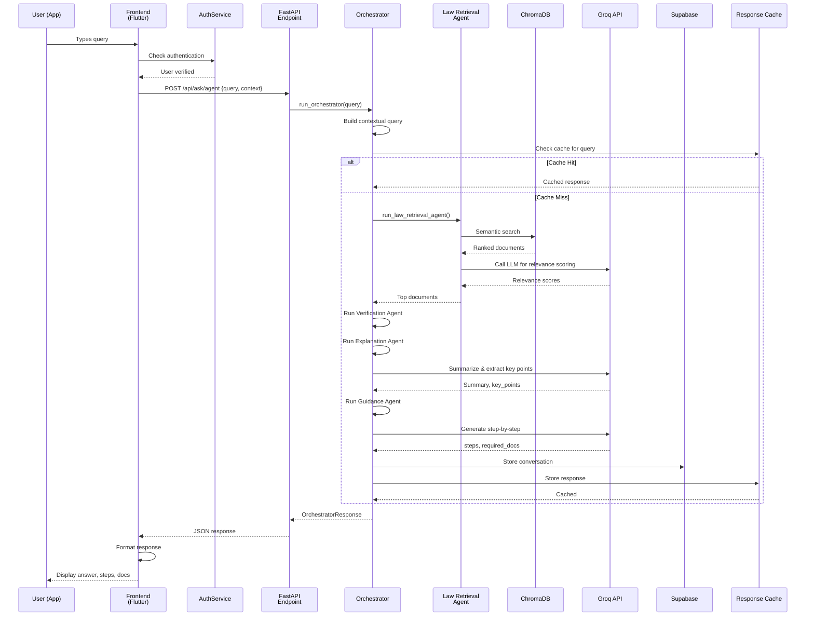
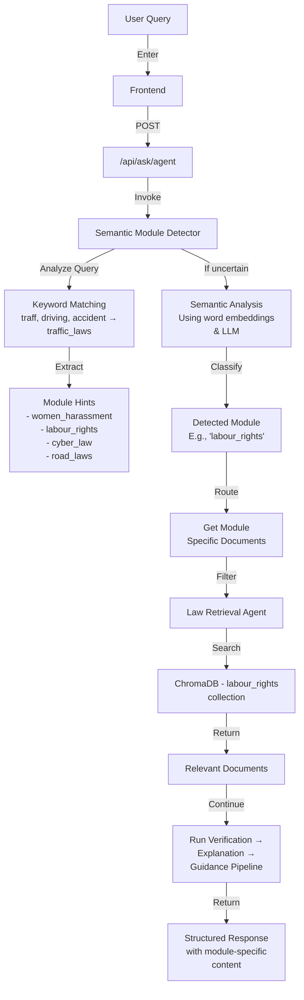
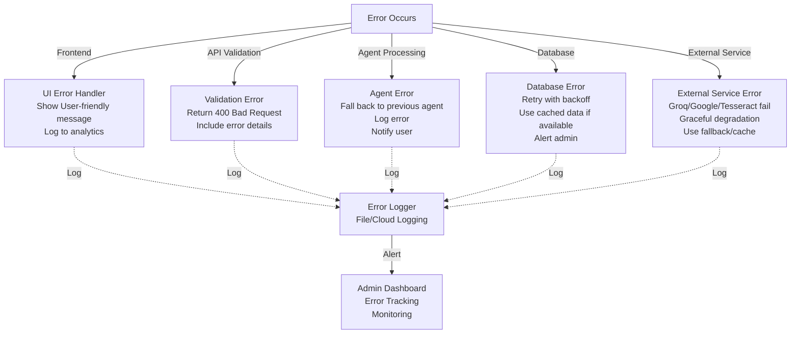

# LegalSathi - Detailed Component Interaction Diagram

## Component Dependency & Interaction Map

```mermaid
graph TB
    subgraph PresentationLayer["🎨 PRESENTATION LAYER (Flutter)"]
        direction TB
        
        subgraph Screens["Screen Components"]
            HomeScreen["🏠 Home Screen"]
            ChatScreen["💬 Chat Screen"]
            ProfileScreen["👤 Profile Screen"]
            NotifyScreen["🔔 Notifications"]
            SettingsScreen["⚙️ Settings"]
        end
        
        subgraph Modules["Domain-Specific Modules"]
            TrafficModule["🚗 Traffic Module"]
            CyberModule["💻 Cyber Law Module"]
            LabourModule["🏢 Labour Rights Module"]
            WomenModule["👩 Women Harassment Module"]
        end
        
        subgraph Widgets["Reusable Widgets"]
            ChatBubble["Chat Bubble Widget"]
            DocumentCard["Document Card"]
            QuickAction["Quick Action Button"]
            CategoryTile["Category Tile"]
        end
        
        Screens -.-> Widgets
        Modules -.-> Widgets
    end
    
    subgraph AppLayer["🔧 APPLICATION LAYER"]
        direction TB
        
        subgraph Services["Core Services"]
            AuthService["🔐 AuthService<br/>- Login/Logout<br/>- Session Mgmt<br/>- Token Refresh"]
            RecentActivityService["📊 ActivityService<br/>- Track Actions<br/>- Store History"]
            LocalizationService["🌐 LocalizationService<br/>- i18n/l10n<br/>- Translation"]
            CacheService["💾 CacheService<br/>- Local Storage<br/>- Offline Cache"]
        end
        
        subgraph Providers["State Management"]
            LanguageProvider["Language Provider"]
            ThemeProvider["Theme Provider"]
            AuthProvider["Auth State Provider"]
            ChatProvider["Chat History Provider"]
        end
        
        subgraph Models["Data Models"]
            AppUserModel["AppUser Model"]
            RecentActivityModel["RecentActivity Model"]
            ScenarioModel["Scenario Model"]
            ChatMessageModel["ChatMessage Model"]
        end
        
        Services -.-> Models
        Providers -.-> Models
    end
    
    subgraph APILayer["⚡ API LAYER (FastAPI)"]
        direction TB
        
        subgraph QueryAPIs["Query APIs"]
            AskAPI["POST /api/ask<br/>Standard RAG"]
            AskAgentAPI["POST /api/ask/agent<br/>Full Agent Pipeline"]
            AskStreamAPI["POST /api/ask/stream<br/>Streaming Response"]
        end
        
        subgraph DocumentAPIs["Document APIs"]
            UploadAPI["POST /api/documents/upload<br/>File Upload Handler"]
            OCRExtractAPI["POST /api/challan/extract-text<br/>Text Extraction"]
            AnalyzeTextAPI["POST /api/evidence/analyze-text<br/>Evidence Analysis"]
        end
        
        subgraph UserAPIs["User APIs"]
            GetLanguageAPI["GET /api/user/{id}/language"]
            SetLanguageAPI["POST /api/user/{id}/language"]
            GetUserProfileAPI["GET /api/user/{id}/profile"]
        end
        
        subgraph NotificationAPIs["Notification APIs"]
            GetNotificationsAPI["GET /api/user/{id}/notifications"]
            MarkReadAPI["POST /api/notifications/{id}/mark_read"]
            CreateNotificationAPI["POST /api/notifications<br/>Create Notification"]
        end
        
        subgraph DocumentMetadataAPIs["Document Metadata APIs"]
            GetAllDocsAPI["GET /api/documents"]
            GetModuleDocsAPI["GET /api/documents/{module_id}"]
            AddDocumentAPI["POST /api/documents/{module_id}/add"]
        end
    end
    
    subgraph BusinessLogicLayer["🤖 BUSINESS LOGIC LAYER (AI Agents)"]
        direction TB
        
        subgraph Orchestrator["Agent Orchestrator"]
            OrchestratorCore["Orchestrator Core<br/>- Pipeline Coordinator<br/>- Response Compiler"]
        end
        
        subgraph AgentPipeline["4-Agent Pipeline"]
            LawRetrieval["1. Law Retrieval Agent<br/>├── Search ChromaDB<br/>├── Query APIs<br/>└── Rank Results"]
            
            Verification["2. Verification Agent<br/>├── Score Credibility<br/>├── Check Recency<br/>└── Filter Results"]
            
            Explanation["3. Explanation Agent<br/>├── Summarize<br/>├── Extract Key Points<br/>└── Plain Language"]
            
            Guidance["4. Guidance Agent<br/>├── Generate Steps<br/>├── Required Docs<br/>└── Action Items"]
            
            LawRetrieval --> Verification
            Verification --> Explanation
            Explanation --> Guidance
        end
        
        subgraph SupportModules["Support Modules"]
            ConvContext["Conversation Context<br/>- Query Enhancement<br/>- History Mgmt"]
            SemanticDetector["Semantic Module Detector<br/>- Module Classification<br/>- Keyword Extraction"]
            DocumentHelper["Document Helper<br/>- Doc Management<br/>- Index Updates"]
            UserDocHelper["User Doc Helper<br/>- File Management<br/>- Metadata"]
        end
        
        OrchestratorCore -.-> AgentPipeline
        AgentPipeline -.-> SupportModules
    end
    
    subgraph DataLayer["🗄️ DATA LAYER"]
        direction TB
        
        subgraph Supabase["Supabase PostgreSQL"]
            UsersTable["Users Table<br/>- Profile Data<br/>- Auth Info"]
            ChatTable["Chat Messages<br/>- Conversations<br/>- History"]
            ComplaintsTable["Complaints<br/>- FIA, Traffic<br/>- Labour, Harassment"]
            NotificationsTable["Notifications<br/>- Alerts<br/>- Status"]
            UserDocsTable["User Documents<br/>- Uploads<br/>- Metadata"]
            LanguagePrefTable["Language Prefs<br/>- User Settings"]
            ResponseCacheTable["Response Cache<br/>- Query Cache<br/>- TTL"]
        end
        
        subgraph ChromaDB["ChromaDB Vector Store"]
            LegalDocsCollection["Legal Documents Collection<br/>- Laws & Acts<br/>- Embeddings"]
            CaseStudiesCollection["Case Studies Collection<br/>- Precedents<br/>- Decisions"]
            ProceduresCollection["Procedures Collection<br/>- Guidelines<br/>- Steps"]
        end
        
        subgraph LocalCache["Local/Redis Cache"]
            QueryCache["Query Result Cache<br/>- Recent Answers<br/>- Embeddings"]
            SessionCache["Session Cache<br/>- User Sessions<br/>- Tokens"]
        end
        
        Supabase -.-> UsersTable
        Supabase -.-> ChatTable
        Supabase -.-> ComplaintsTable
        Supabase -.-> NotificationsTable
        Supabase -.-> UserDocsTable
    end
    
    subgraph ExternalServices["☁️ EXTERNAL SERVICES"]
        direction TB
        
        GroqAPI["Groq API<br/>Model: llama2-70b<br/>- Async Completion<br/>- Streaming<br/>- Embeddings"]
        
        GoogleAuth["Google OAuth 2.0<br/>- Sign In<br/>- Account Verification"]
        
        TesseractOCR["Tesseract OCR<br/>- Text Extraction<br/>- Challan Scanning"]
        
        Webhook["Webhook Service<br/>- Real-time Updates<br/>- Notifications"]
    end
    
    %% CROSS-LAYER CONNECTIONS
    
    %% Presentation → Application
    Screens -->|Uses| AuthService
    Screens -->|Uses| CacheService
    ChatScreen -->|Uses| ChatProvider
    ProfileScreen -->|Uses| LanguageProvider
    SettingsScreen -->|Uses| ThemeProvider
    
    %% Application → API
    AuthService -->|Calls| GetUserProfileAPI
    RecentActivityService -->|Calls| GetAllDocsAPI
    LocalizationService -->|Calls| GetLanguageAPI
    CacheService -->|Reads| ResponseCacheTable
    
    %% Presentation → Data (Direct Cache)
    Screens -->|Reads| QueryCache
    ChatScreen -->|Stores| QueryCache
    
    %% API → Business Logic
    AskAPI -->|Triggers| OrchestratorCore
    AskAgentAPI -->|Triggers| OrchestratorCore
    AskStreamAPI -->|Triggers| OrchestratorCore
    UploadAPI -->|Triggers| UserDocHelper
    OCRExtractAPI -->|Calls| TesseractOCR
    
    %% Business Logic → Data
    LawRetrieval -->|Queries| ChromaDB
    LawRetrieval -->|Searches| LegalDocsCollection
    Verification -->|Uses Cache| ResponseCacheTable
    OrchestratorCore -->|Stores Result| ResponseCacheTable
    
    %% API → External Services
    AskAgentAPI -->|Calls| GroqAPI
    UploadAPI -->|Calls| TesseractOCR
    AuthService -->|Calls| GoogleAuth
    
    %% Support Modules → Data
    DocumentHelper -->|Updates| LegalDocsCollection
    ConvContext -->|Reads| ChatTable
    SemanticDetector -->|Uses| LegalDocsCollection
    
    %% Styling
    classDef presentationStyle fill:#E1F5FF,stroke:#01579B,stroke-width:2px
    classDef applicationStyle fill:#F3E5F5,stroke:#4A148C,stroke-width:2px
    classDef apiStyle fill:#FCE4EC,stroke:#880E4F,stroke-width:2px
    classDef businessLogicStyle fill:#FFF3E0,stroke:#E65100,stroke-width:2px
    classDef dataStyle fill:#E8F5E9,stroke:#1B5E20,stroke-width:2px
    classDef externalStyle fill:#FFF9C4,stroke:#F57F17,stroke-width:2px
    
    class PresentationLayer presentationStyle
    class AppLayer applicationStyle
    class APILayer apiStyle
    class BusinessLogicLayer businessLogicStyle
    class DataLayer dataStyle
    class ExternalServices externalStyle
```

---

## Data Flow: Query Processing

---

## Module Classification Flow

---

## Architecture Decision Record (ADR)

### ADR-1: Four-Agent Pipeline Architecture

**Status:** Adopted

**Context:** Need for comprehensive legal analysis with multiple perspectives

**Decision:** Implement a 4-stage agent pipeline (Retrieval → Verification → Explanation → Guidance)

**Rationale:**
- Separation of concerns improves maintainability
- Each agent specializes in one task
- Easy to swap/upgrade individual agents
- Better error isolation and recovery

**Consequences:**
- Increased latency (mitigated by caching)
- More complex orchestration
- Better result quality and user trust

---

### ADR-2: Separate Vector DB (ChromaDB)

**Status:** Adopted

**Context:** Need for fast semantic search of legal documents

**Decision:** Use ChromaDB for vector storage alongside Supabase PostgreSQL

**Rationale:**
- Semantic search impossible with traditional SQL
- ChromaDB lightweight and easy to embed
- Superior performance on similarity queries
- No dependency on external ML services

**Consequences:**
- Additional database to maintain
- Synchronization required between PostgreSQL and ChromaDB
- Embedding generation overhead

---

### ADR-3: Groq API for LLM

**Status:** Adopted

**Context:** Need fast, cost-effective LLM inference

**Decision:** Use Groq API instead of OpenAI/local models

**Rationale:**
- Low latency (< 1 second typical)
- Cost-effective pricing
- High throughput
- Compatible with OpenAI SDK

**Consequences:**
- Dependency on external service
- API rate limits
- Internet connectivity required

---

### ADR-4: Flutter for Cross-Platform Frontend

**Status:** Adopted

**Context:** Need support for iOS, Android, and Web

**Decision:** Use Flutter with responsive design

**Rationale:**
- Single codebase for all platforms
- Good performance and UX
- Active ecosystem
- Material Design 3 support

**Consequences:**
- Flutter learning curve for new developers
- Platform-specific issues
- Larger app size

---

### ADR-5: Supabase for Auth & Realtime

**Status:** Adopted

**Context:** Need authentication, realtime updates, and PostgreSQL

**Decision:** Use Supabase as primary backend

**Rationale:**
- Combines auth + DB + storage
- Built-in realtime capabilities
- Open-source (self-hostable)
- PostgreSQL power with ease of use

**Consequences:**
- Vendor lock-in (can self-host)
- Cost scaling with usage
- Limited customization of auth flow

---

## Component Dependency Matrix

| Component | Depends On | Used By |
|-----------|-----------|---------|
| AuthService | Supabase, Google OAuth | All Services, UI |
| ChatScreen | ChatProvider, AuthService, API | User (UI) |
| Law Retrieval Agent | ChromaDB, Groq, Semantic Detector | Orchestrator |
| Verification Agent | Groq, Response Cache | Orchestrator |
| FastAPI | Pydantic, CORS, Auth | Flutter Frontend |
| ChromaDB | Embeddings, LegalDocs | Law Retrieval Agent |
| Supabase | PostgreSQL, Auth Server | All Backend Services |
| Groq API | Network (HTTP) | All Agents |

---

## Performance Metrics & SLOs

| Metric | Target | Current |
|--------|--------|---------|
| API Response Time (cached) | < 500ms | - |
| API Response Time (full pipeline) | < 5s | - |
| Vector Search Latency | < 200ms | - |
| ChromaDB Index Size | < 5GB | Growing |
| Frontend Load Time | < 3s | - |
| Cache Hit Rate | > 60% | - |
| LLM Inference Time | < 2s | ~1.5s (Groq) |
| Database Query Time | < 100ms | - |
| OCR Extraction Time | < 2s per page | - |

---

## Error Handling Architecture

---

## Deployment Checklist

- [ ] Database migrations completed
- [ ] Vector indexes built & optimized
- [ ] API endpoints tested
- [ ] Frontend build optimized
- [ ] Authentication configured
- [ ] Environment variables set
- [ ] SSL certificates installed
- [ ] CORS policies configured
- [ ] Rate limiting enabled
- [ ] Monitoring & logging setup
- [ ] Backup strategy verified
- [ ] Load testing passed
- [ ] Security audit completed
- [ ] Documentation updated
- [ ] User onboarding materials ready

